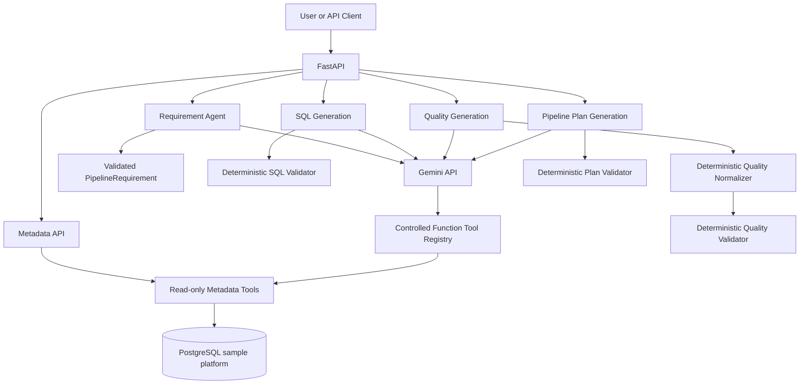

# AI Data Pipeline Copilot

AI Data Pipeline Copilot is a portfolio FastAPI project that uses Google Gemini plus deterministic local validators to produce inspect-only data pipeline artifacts:

```text
Natural-language request
  -> PipelineRequirement
  -> GeneratedSQL
  -> GeneratedDataQualityPlan
  -> PipelinePlan
```

The project demonstrates how an AI-assisted data platform can use strict contracts, read-only metadata tools, and local semantic validation to keep generated artifacts reviewable and safe.

## Problem Statement

Data pipeline design often requires translating business intent into consistent requirements, SQL, quality checks, and execution plans. This project automates artifact drafting while preserving an explicit safety boundary: AI-generated SQL, quality rules, and pipeline plans are never automatically executed.

## Major Features

- FastAPI application with health, metadata, requirement, SQL, quality, and pipeline-plan endpoints.
- PostgreSQL sample data platform with `raw`, `curated`, and `metadata` schemas.
- Read-only metadata intelligence tools exposed to Gemini through controlled function calling.
- Strict `PipelineRequirement` model with safe identifiers, declarative transformations, load strategy, and schedule validation.
- Gemini-backed requirement agent with one semantic correction attempt for invalid structured output.
- Guarded PostgreSQL SQL generation with deterministic validation.
- Incremental SQL guardrail requiring `:last_successful_watermark`.
- Structured data-quality plan generation with deterministic normalization for safe derivations.
- Structured pipeline-plan generation with dependency, cycle, schedule, and artifact-consistency validation.
- Mocked test suite covering provider paths, safety boundaries, and cross-phase consistency.

## Technology Stack

- Python 3.11+
- FastAPI
- PostgreSQL
- SQLAlchemy 2.x and psycopg
- Pydantic 2 and pydantic-settings
- Google Gen AI Python SDK
- pytest
- Docker Compose

## Safety Model

The system is inspect-only.

- Generated SQL is returned for review and is not executed.
- Generated quality rules are returned for review and are not executed.
- Generated pipeline plans are implementation blueprints and are not orchestrated.
- Metadata tools are read-only and do not accept arbitrary SQL.
- Gemini has no tool for SQL execution, database writes, shell execution, Python execution, remediation, or infrastructure provisioning.
- Local deterministic validators are authoritative; Gemini-declared `validation_status`, warnings, and errors are treated as untrusted.

## Architecture



## API Summary

- `GET /` - application information.
- `GET /health` - application and database health summary.
- `GET /metadata/tables` - list available business tables.
- `GET /metadata/schema/{schema_name}/{table_name}` - inspect physical schema.
- `GET /metadata/table/{schema_name}/{table_name}` - table metadata.
- `GET /metadata/columns/{schema_name}/{table_name}` - column metadata.
- `GET /metadata/sample/{schema_name}/{table_name}?limit=5` - bounded sample rows.
- `GET /metadata/count/{schema_name}/{table_name}` - table row count.
- `GET /metadata/pipeline/{pipeline_name}` - stored pipeline metadata.
- `POST /requirements/validate` - validate a structured `PipelineRequirement`.
- `GET /requirements/example` - deterministic `customer_revenue_daily` example.
- `POST /agent/requirements` - generate a requirement from natural language.
- `POST /sql/generate` - generate inspectable PostgreSQL SQL.
- `POST /quality/generate` - generate inspectable data-quality rules.
- `POST /pipeline-plan/generate` - generate an inspectable pipeline plan from prior artifacts.

## Setup

Create and activate a virtual environment:

```powershell
python -m venv .venv
.\.venv\Scripts\Activate.ps1
```

Install dependencies:

```powershell
pip install -r requirements.txt
```

Create local configuration when needed:

```powershell
Copy-Item .env.example .env
```

Set `GEMINI_API_KEY` only when running live Gemini-backed endpoints. Do not commit `.env`.

## Environment Configuration

`.env.example` documents supported settings:

- `APP_NAME`, `APP_ENV`, `APP_HOST`, `APP_PORT`, `LOG_LEVEL`
- `POSTGRES_HOST`, `POSTGRES_PORT`, `POSTGRES_DB`, `POSTGRES_USER`, `POSTGRES_PASSWORD`
- `GEMINI_API_KEY`
- `GEMINI_MODEL`

`GEMINI_MODEL` defaults to `gemini-3.6-flash`.

## Running PostgreSQL

Start PostgreSQL:

```powershell
docker compose up -d postgres
```

Initialize sample schemas, tables, data, and metadata:

```powershell
python scripts/init_database.py
```

Verify the database:

```powershell
python scripts/verify_database.py
```

## Starting FastAPI

```powershell
uvicorn app.main:app --host 127.0.0.1 --port 8000 --reload
```

Open interactive docs at `http://127.0.0.1:8000/docs`.

## Example API Flow

Generate a requirement:

```powershell
Invoke-RestMethod -Method Post -Uri http://127.0.0.1:8000/agent/requirements -ContentType 'application/json' -Body '{
  "request": "Create a daily pipeline that joins customers and completed orders and calculates total revenue per customer."
}'
```

Generate SQL from a requirement:

```json
{
  "pipeline_name": "customer_revenue_daily",
  "sources": [
    {"table": {"schema_name": "raw", "table_name": "customers"}, "alias": "c"},
    {"table": {"schema_name": "raw", "table_name": "orders"}, "alias": "o"}
  ],
  "target": {"table": {"schema_name": "curated", "table_name": "customer_revenue"}, "write_mode": "merge"},
  "transformations": [
    {"rule_type": "join", "description": "Join customers and orders by customer_id.", "input_columns": ["c.customer_id", "o.customer_id"], "expression": {"left_column": "c.customer_id", "right_column": "o.customer_id", "join_type": "inner"}},
    {"rule_type": "filter", "description": "Keep completed orders.", "input_columns": ["o.status"], "expression": {"column": "o.status", "operator": "equals", "value": "completed"}}
  ],
  "load_strategy": {"load_type": "incremental", "watermark_column": "last_order_date", "deduplication_keys": ["customer_id"]},
  "schedule": {"frequency": "daily", "timezone": "UTC", "enabled": true}
}
```

The `/sql/generate` response is a `GeneratedSQL` artifact containing `sql`, `source_tables`, `target_table`, `statement_type`, local `validation_status`, warnings, and validation errors.

Generate quality rules by posting the same `PipelineRequirement` JSON to `/quality/generate`. The response is a `GeneratedDataQualityPlan` with structured rules and local validation status.

Generate a pipeline plan:

```json
{
  "requirement": { "...": "PipelineRequirement JSON" },
  "generated_sql": { "...": "GeneratedSQL JSON from /sql/generate" },
  "quality_plan": { "...": "GeneratedDataQualityPlan JSON from /quality/generate" }
}
```

The `/pipeline-plan/generate` response is an inspect-only `PipelinePlan` with ordered steps, dependencies, referenced quality checks, observability expectations, warnings, and validation errors.

## Error Handling

- FastAPI/Pydantic request validation returns `422`.
- Missing Gemini configuration returns `400` on generation endpoints.
- Malformed provider output returns `502`.
- Gemini quota/rate-limit failures map to `429` when reliably identifiable.
- Temporary Gemini failures map to `503`.
- Unexpected internal failures use FastAPI's default `500` handling.

The requirement-agent endpoint returns a structured `PipelineAgentResult` with `status="error"` for known agent failures to preserve its agent response contract.

## Testing

Run all tests:

```powershell
pytest
```

Compile validation:

```powershell
python -m compileall app agent config database pipeline pipeline_plan quality sql_generation tests
```

The test suite mocks Gemini clients and does not make live network or billable provider calls.

## Project Limitations

- Generated SQL is not executed.
- Quality rules are not executed.
- Pipeline plans are not orchestrated.
- Runtime watermark values must be supplied by a future execution/orchestration layer using `:last_successful_watermark`.
- Gemini availability and quota can affect live generation endpoints.
- Metadata-aware validation is limited to the metadata available in this sample project.
- The project does not include a frontend, CI/CD, Airflow, dbt, cloud provisioning, authentication, or authorization.

## Future Enhancements

- Authenticated API access.
- CI pipeline with linting and coverage reporting.
- Optional executor/orchestrator layer that consumes reviewed artifacts.
- Richer metadata catalog integration.
- UI for reviewing generated artifacts and validation findings.
