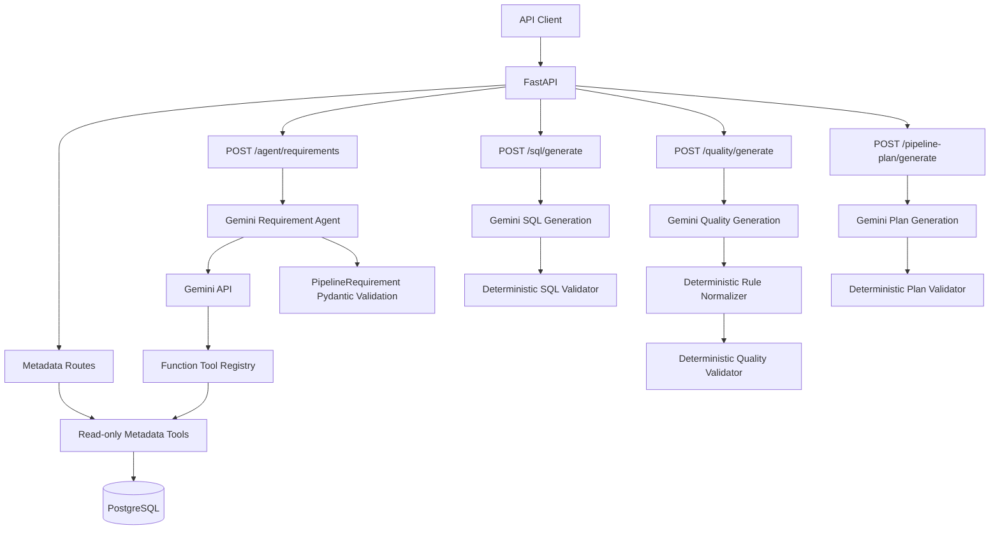

# Architecture

AI Data Pipeline Copilot is an inspect-only artifact generation service. It combines FastAPI, PostgreSQL metadata, Google Gemini, strict Pydantic models, and deterministic validators.

## High-Level Flow

## Metadata Layer

The metadata layer is implemented in `agent/tools/metadata_tools.py` and exposed through `app/metadata.py`.

It provides read-only operations:

- table discovery for `raw` and `curated`
- schema inspection
- table and column business metadata
- bounded sample records
- row counts
- pipeline metadata lookup

The metadata tools validate identifiers, cap sample sizes, use SQLAlchemy Core constructs, and do not expose arbitrary SQL or write operations.

## PipelineRequirement Generation

The requirement agent lives in `agent/pipeline_agent.py`.

Gemini receives the natural-language request plus a controlled tool declaration. It may call only the registered metadata tools through `agent/tool_registry.py`. The local dispatcher validates tool arguments, rejects unknown tools, serializes read-only results, and sends function responses back to Gemini.

The final model response is parsed as a strict `PipelineRequirement`. Local Pydantic validation is authoritative. If the first final response is semantically invalid, the agent sends the validation errors back once and accepts only one corrected response.

## SQL Generation

SQL generation lives in `sql_generation/`.

Gemini produces a structured `GeneratedSQL` artifact. The local validator checks:

- pipeline name consistency
- PostgreSQL dialect
- source and target table consistency
- one-statement inspectable SQL
- prohibited administrative/destructive SQL
- unrelated table references
- statement type consistency
- write-mode expectations
- incremental watermark semantics

Incremental SQL must use `:last_successful_watermark` when an incremental or watermark column is configured. The system does not supply or invent a runtime watermark value.

## Quality Generation

Quality generation lives in `quality/`.

Gemini produces a `GeneratedDataQualityPlan`. The deterministic normalizer may fill missing structured parameters only when they are directly derived from the validated requirement:

- freshness thresholds from schedule: hourly -> 2 hours, daily -> 2 days, weekly -> 14 days
- referential-integrity references from explicit join column pairs
- accepted-values lists from explicit equality filters

The validator then checks rule shape, table scope, duplicate rules, required parameters, schedule-justified freshness thresholds, join-justified referential integrity, filter-justified accepted values, and metadata-based column type constraints when metadata is available.

## Pipeline-Plan Generation

Pipeline-plan generation lives in `pipeline_plan/`.

Gemini produces a structured `PipelinePlan` from the authoritative `PipelineRequirement`, `GeneratedSQL`, and `GeneratedDataQualityPlan` artifacts.

The local validator checks:

- pipeline name consistency across artifacts
- SQL source/target consistency
- upstream SQL and quality validation status
- schedule consistency
- unique step IDs
- unknown dependencies
- self dependencies
- dependency cycles
- unrelated table references
- target quality validation ordering
- referenced quality checks

Descriptions are allowed to use implementation-neutral planning prose. Literal SQL, Python, and shell payloads remain rejected by narrow executable-pattern detection.

## Gemini Boundary

Gemini is used only to draft structured artifacts. It does not receive any tool capable of:

- executing generated SQL
- writing to the database
- executing quality rules
- executing pipeline plans
- running shell commands
- running Python commands
- provisioning infrastructure
- performing remediation

Provider errors are logged with sanitized metadata and mapped to controlled API errors where applicable.

## Inspect-Only Execution Boundary

All generated artifacts are review artifacts.

The application does not include an execution engine. There is no API route that runs generated SQL, evaluates generated quality rules, schedules a pipeline, provisions cloud resources, or performs autonomous remediation.

Future execution support would need a separate reviewed runtime layer with explicit authentication, authorization, parameter binding, audit logging, and rollback controls.
